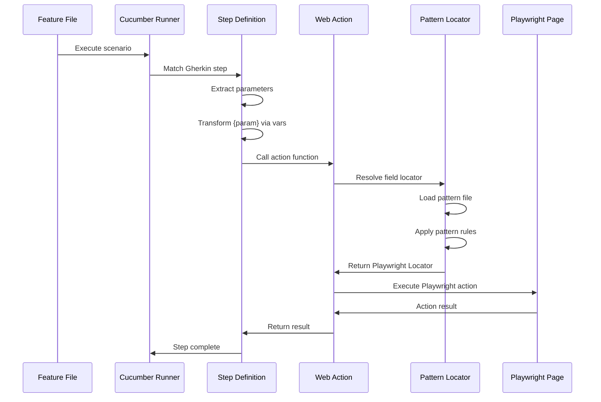

# Design Document: Cucumber Integration

## Overview

This design document outlines the integration of Cucumber BDD framework with the existing Playwright-based automation framework. The integration will enable test engineers to write human-readable feature files using Gherkin syntax while leveraging the framework's existing Pattern Locator system and web actions.

The design follows a layered architecture that maintains separation of concerns:
- **Feature Layer**: Gherkin feature files describing test scenarios
- **Step Definition Layer**: TypeScript code mapping Gherkin steps to web actions
- **Action Layer**: Existing web actions (already implemented)
- **Pattern Locator Layer**: Existing pattern-based element resolution (already implemented)

## Architecture

### High-Level Architecture

```
┌─────────────────────────────────────────────────────────────┐
│                     Feature Files (.feature)                 │
│                    (Gherkin Syntax)                          │
└────────────────────────┬────────────────────────────────────┘
                         │
                         ▼
┌─────────────────────────────────────────────────────────────┐
│                  Step Definitions Layer                      │
│              (webStepDefs.ts + custom steps)                 │
│                                                              │
│  ┌──────────────────────────────────────────────────────┐  │
│  │  Cucumber Parameter Types & Transformations          │  │
│  │  - {param}: vars.replaceVariables()                  │  │
│  │  - {string}, {int}, {float}                          │  │
│  └──────────────────────────────────────────────────────┘  │
└────────────────────────┬────────────────────────────────────┘
                         │
                         ▼
┌─────────────────────────────────────────────────────────────┐
│                    Web Actions Layer                         │
│              (webActions.ts - EXISTING)                      │
│                                                              │
│  • openBrowser()      • clickButton()                        │
│  • fill()             • verifyTextOnPage()                   │
│  • selectDropdown()   • waitForUrl()                         │
└────────────────────────┬────────────────────────────────────┘
                         │
                         ▼
┌─────────────────────────────────────────────────────────────┐
│                 Pattern Locator Resolution                   │
│              (webLocFixture.ts - EXISTING)                   │
│                                                              │
│  • Pattern file loading                                      │
│  • Locator caching                                           │
│  • Dynamic resolution                                        │
└─────────────────────────────────────────────────────────────┘
```

### Component Interaction Flow



## Components and Interfaces

### 1. Feature File Structure

Feature files will be organized in a dedicated directory structure:

```
features/
├── login/
│   └── user-login.feature
├── checkout/
│   └── shopping-cart.feature
└── common/
    └── navigation.feature
```

**Feature File Format:**
```gherkin
Feature: User Login
  As a user
  I want to log into the application
  So that I can access my account

  Background:
    Given Web: Open browser -url: "{{baseUrl}}" -options: ""

  @smoke
  Scenario: Successful login with valid credentials
    When Web: Fill -field: "loginPage.usernameInput" -value: "{{username}}" -options: ""
    And Web: Fill -field: "loginPage.passwordInput" -value: "{{password}}" -options: ""
    And Web: Click button -field: "loginPage.loginButton" -options: ""
    Then Web: Verify text on page -text: "Welcome" -options: "{partialMatch: true}"
    And Web: Wait for URL -url: "{{baseUrl}}/dashboard" -options: ""

  @regression
  Scenario Outline: Login with different user types
    When Web: Fill -field: "loginPage.usernameInput" -value: "<username>" -options: ""
    And Web: Fill -field: "loginPage.passwordInput" -value: "<password>" -options: ""
    And Web: Click button -field: "loginPage.loginButton" -options: ""
    Then Web: Verify text on page -text: "<expectedMessage>" -options: "{partialMatch: true}"

    Examples:
      | username | password | expectedMessage |
      | admin    | admin123 | Admin Dashboard |
      | user     | user123  | User Dashboard  |
```

### 2. Step Definition Layer

**File: `src/helper/actions/webStepDefs.ts` (EXISTING - needs enhancement)**

The step definitions act as a thin adapter layer between Gherkin steps and web actions. Each step definition:
1. Extracts parameters from the Gherkin step
2. Transforms parameters using the vars system
3. Calls the corresponding web action
4. Handles errors and attaches logs

**Step Definition Pattern:**
```typescript
Given("Web: <Action> -field: {param} -options: {param}", async function (field, options) {
  let page = webFixture.getCurrentPage();
  await webActions.<action>(page, field, options);
});
```

**Parameter Transformation:**
The `{param}` custom parameter type will:
- Accept any string value
- Apply `vars.replaceVariables()` to resolve variables like `{{baseUrl}}`
- Support pattern locator references like `loginPage.usernameInput`

### 3. Cucumber Configuration

**File: `cucumber.js` (EXISTING - needs updates)**

Current configuration:
```javascript
module.exports = {
    default: {
        paths: ["./_TEMP/execution/**/*.feature"],
        require: [
            "ts-node/register",
            "tsconfig-paths/register",
            "./src/global.ts",
            "./test/steps/**/*.ts",
            "./extend/addons/**/*.ts",
            "./src/helper/actions/*.ts",
            "config/cucumber/hooks.ts",
            "config/cucumber/stepHook.ts"
        ],
        format: [
            "progress-bar",
            "html:test-results/cucumber-report.html",
            "json:test-results/cucumber-report.json",
            "rerun:@rerun.txt"
        ],
        parallel: 1
    }
}
```

**Proposed Updates:**
- Add `features/**/*.feature` to paths for direct feature file execution
- Keep `_TEMP/execution/**/*.feature` for dynamic test execution
- Add support for multiple profiles (smoke, regression, etc.)

### 4. Hooks and Lifecycle Management

**File: `config/cucumber/hooks.ts` (EXISTING - working correctly)**

The existing hooks provide:
- **BeforeAll**: Browser launch and environment setup
- **Before**: Scenario-specific setup (with @auth tag support)
- **After**: Screenshot/video/trace capture and cleanup
- **AfterAll**: Browser shutdown

**Hook Flow:**
```
BeforeAll
  └─> Launch browser (if UI test)
  └─> Clean up test-results folder

Before (each scenario)
  └─> Create new browser context
  └─> Start tracing
  └─> Create new page
  └─> Set World context

After (each scenario)
  └─> Check soft assertions
  └─> Capture artifacts (screenshot/video/trace)
  └─> Close page and context

AfterAll
  └─> Close all browsers
```

### 5. Pattern Locator Integration

**File: `src/helper/fixtures/webLocFixture.ts` (EXISTING)**

The Pattern Locator system is already integrated into web actions through the `webLocResolver` function. Step definitions will pass pattern references (e.g., `loginPage.usernameInput`) directly to web actions, which will:

1. Parse the pattern reference (page.field format)
2. Load the corresponding pattern file
3. Apply pattern rules to generate a Playwright locator
4. Cache the locator for performance

**Pattern File Example:**
```typescript
// resources/locators/pattern/loginPage.pattern.ts
export const loginPage = {
  usernameInput: {
    text: "Username",
    type: "input"
  },
  passwordInput: {
    text: "Password",
    type: "input"
  },
  loginButton: {
    text: "Login",
    type: "button"
  }
};
```

### 6. Variable and Data Management

**File: `src/helper/bundle/vars.ts` (EXISTING)**

The vars system provides:
- Environment variable resolution
- Configuration value access
- Variable replacement in strings using `{{variableName}}` syntax
- Test data storage and retrieval

**Integration with Cucumber:**
- Feature files use `{{variableName}}` syntax
- Step definitions call `vars.replaceVariables()` automatically
- Scenario-specific data can be stored using `vars.setValue()`

### 7. Test Execution and Reporting

**Execution Flow:**
```
1. User runs: npm test -- --tags "@smoke"
2. Cucumber loads configuration from cucumber.js
3. Cucumber discovers feature files matching tags
4. For each scenario:
   a. Execute BeforeAll (once)
   b. Execute Before hooks
   c. Execute scenario steps
   d. Execute After hooks (capture artifacts)
5. Execute AfterAll (once)
6. Generate reports (HTML, JSON)
```

**Report Artifacts:**
- HTML report: `test-results/cucumber-report.html`
- JSON report: `test-results/cucumber-report.json`
- Screenshots: `test-results/scenarios/<scenario-name>/screenshot.png`
- Videos: `test-results/scenarios/<scenario-name>/video.webm`
- Traces: `test-results/scenarios/<scenario-name>/trace.zip`

## Data Models

### Cucumber World Context

The Cucumber World object maintains state across steps within a scenario:

```typescript
interface CucumberWorld {
  // Provided by Cucumber
  attach: (data: Buffer | string, mediaType: string) => Promise<void>;
  parameters: Record<string, any>;
  
  // Custom properties (added by framework)
  softAssertionFailed?: boolean;
  softAssertionStep?: string;
  
  // Set by webFixture
  page?: Page;
  context?: BrowserContext;
}
```

### Step Definition Options

Options passed to web actions follow a consistent structure:

```typescript
interface WebActionOptions {
  // Timing
  actionTimeout?: number;
  
  // Pattern resolution
  pattern?: string;
  smartIQ_refreshLoc?: string;
  
  // Screenshots
  screenshot?: boolean;
  screenshotText?: string;
  screenshotFullPage?: boolean;
  screenshotField?: boolean;
  screenshotBefore?: boolean;
  
  // Verification
  partialMatch?: boolean;
  ignoreCase?: boolean;
  assert?: boolean;
  
  // Other
  iframe?: string;
  force?: boolean;
}
```

### Feature File Metadata

```typescript
interface FeatureMetadata {
  name: string;
  description: string;
  tags: string[];
  scenarios: ScenarioMetadata[];
}

interface ScenarioMetadata {
  name: string;
  tags: string[];
  steps: StepMetadata[];
}

interface StepMetadata {
  keyword: 'Given' | 'When' | 'Then' | 'And' | 'But';
  text: string;
  parameters: any[];
}
```

## Correctness Properties

*A property is a characteristic or behavior that should hold true across all valid executions of a system—essentially, a formal statement about what the system should do. Properties serve as the bridge between human-readable specifications and machine-verifiable correctness guarantees.*

### Property 1: Step Definition Resolution
*For any* valid Gherkin step that matches a registered step definition pattern, the Cucumber runner should successfully resolve and execute the corresponding step definition function.

**Validates: Requirements 2.1, 2.5**

### Property 2: Parameter Extraction and Transformation
*For any* Gherkin step with parameters using `{param}` syntax, the extracted parameter values should be correctly passed to the web action after variable replacement.

**Validates: Requirements 2.2, 6.1**

### Property 3: Pattern Locator Resolution
*For any* step parameter that references a pattern locator (format: `pageName.fieldName`), the framework should resolve it to a valid Playwright locator using the Pattern Locator system.

**Validates: Requirements 3.1, 3.2**

### Property 4: Browser Context Isolation
*For any* two scenarios running in parallel, each scenario should have its own isolated browser context such that actions in one scenario do not affect the other.

**Validates: Requirements 5.4**

### Property 5: Artifact Capture on Failure
*For any* scenario that fails, the framework should capture and attach at least one artifact (screenshot, video, or trace) to the test report.

**Validates: Requirements 4.2, 4.5**

### Property 6: Variable Replacement Idempotence
*For any* string containing variable placeholders (e.g., `{{baseUrl}}`), applying `vars.replaceVariables()` multiple times should produce the same result as applying it once.

**Validates: Requirements 6.1**

### Property 7: Hook Execution Order
*For any* scenario execution, hooks should execute in the correct order: BeforeAll → Before → Steps → After → AfterAll, and After hooks should execute even if the scenario fails.

**Validates: Requirements 9.1, 9.2, 9.3, 9.4, 9.5**

### Property 8: Tag-Based Filtering
*For any* Cucumber execution with a tag filter (e.g., `@smoke`), only scenarios tagged with that tag should be executed.

**Validates: Requirements 8.3**

### Property 9: Soft Assertion Accumulation
*For any* scenario using soft assertions, all soft assertion failures should be accumulated and reported at the end of the scenario, not immediately failing the test.

**Validates: Requirements 10.3, 10.4**

### Property 10: Step Definition Uniqueness
*For any* set of registered step definitions, no two step definitions should have patterns that match the same Gherkin step text.

**Validates: Requirements 7.4**

## Error Handling

### 1. Step Definition Not Found

**Error Scenario**: A Gherkin step doesn't match any registered step definition.

**Handling**:
```typescript
// Cucumber automatically reports:
// "Undefined step: <step text>"
// And suggests a step definition template
```

**User Experience**:
- Clear error message in console
- Suggested step definition code snippet
- Test execution stops at the undefined step

### 2. Pattern Locator Not Found

**Error Scenario**: A pattern reference (e.g., `loginPage.usernameInput`) cannot be resolved.

**Handling**:
```typescript
// In webLocResolver:
if (!patternFile || !patternFile[fieldName]) {
  throw new Error(
    `Pattern field "${pageName}.${fieldName}" not found. ` +
    `Check if pattern file exists at: resources/locators/pattern/${pageName}.pattern.ts`
  );
}
```

**User Experience**:
- Descriptive error with file path
- Screenshot attached to report
- Scenario marked as failed

### 3. Element Not Found

**Error Scenario**: A Playwright locator cannot find the element on the page.

**Handling**:
```typescript
// Playwright automatically throws TimeoutError
// Web actions catch and enhance the error:
try {
  await target.click({ timeout: actionTimeout });
} catch (error) {
  const enhancedError = new Error(
    `Failed to click element "${field}". ` +
    `Resolved locator: ${target}. ` +
    `Original error: ${error.message}`
  );
  await attachLog(enhancedError.message, 'text/plain');
  throw enhancedError;
}
```

**User Experience**:
- Enhanced error with locator details
- Screenshot of page state
- Trace file for debugging

### 4. Variable Not Found

**Error Scenario**: A variable placeholder (e.g., `{{missingVar}}`) cannot be resolved.

**Handling**:
```typescript
// In vars.replaceVariables():
if (!vars.hasValue(varName)) {
  console.warn(`Variable "${varName}" not found, using placeholder as-is`);
  return placeholder; // Return {{missingVar}} unchanged
}
```

**User Experience**:
- Warning logged to console
- Test continues with placeholder value
- May cause subsequent failures if variable is required

### 5. Soft Assertion Failures

**Error Scenario**: Multiple soft assertions fail within a scenario.

**Handling**:
```typescript
// In After hook:
if (world.softAssertionFailed) {
  const failedStep = world.softAssertionStep || 'Unknown Step';
  throw new Error(
    `Soft assertion(s) failed at step: "${failedStep}" ` +
    `in scenario: "${ctx.pickle.name}"`
  );
}
```

**User Experience**:
- Scenario continues executing all steps
- All soft assertion failures are logged
- Scenario marked as failed at the end
- Report shows all failures, not just the first

### 6. Browser Launch Failure

**Error Scenario**: Browser fails to launch in BeforeAll hook.

**Handling**:
```typescript
// In testLifecycleHooks.ts:
try {
  await webFixture.launchBrowser();
} catch (error) {
  console.error('Failed to launch browser:', error);
  throw new Error(
    'Browser launch failed. Check Playwright installation: ' +
    'Run "npx playwright install"'
  );
}
```

**User Experience**:
- Clear error message with remediation steps
- All tests skipped
- Execution stops immediately

## Testing Strategy

### Unit Tests

Unit tests will verify individual components in isolation:

1. **Parameter Transformation Tests**
   - Test `vars.replaceVariables()` with various inputs
   - Test parameter extraction from Gherkin steps
   - Test edge cases (empty strings, special characters)

2. **Pattern Locator Resolution Tests**
   - Test pattern file loading
   - Test locator generation from patterns
   - Test caching behavior

3. **Hook Execution Tests**
   - Test hook execution order
   - Test artifact capture logic
   - Test cleanup behavior

### Property-Based Tests

Property-based tests will verify universal properties across many generated inputs:

1. **Property Test: Step Definition Resolution**
   - Generate random valid Gherkin steps
   - Verify each step resolves to a step definition
   - Verify step execution completes without errors

2. **Property Test: Variable Replacement Idempotence**
   - Generate random strings with variable placeholders
   - Apply `vars.replaceVariables()` multiple times
   - Verify results are identical

3. **Property Test: Pattern Locator Resolution**
   - Generate random pattern references
   - Verify each resolves to a valid locator
   - Verify locators are cached correctly

4. **Property Test: Browser Context Isolation**
   - Generate random scenario pairs
   - Execute scenarios in parallel
   - Verify no state leakage between contexts

5. **Property Test: Artifact Capture**
   - Generate random failing scenarios
   - Verify artifacts are captured for each failure
   - Verify artifact files exist and are valid

### Integration Tests

Integration tests will verify end-to-end workflows:

1. **Feature File Execution Test**
   - Create a sample feature file
   - Execute it using Cucumber
   - Verify all steps execute successfully
   - Verify report is generated

2. **Pattern Locator Integration Test**
   - Create a feature using pattern locators
   - Execute against a test page
   - Verify elements are found and interacted with correctly

3. **Parallel Execution Test**
   - Create multiple feature files
   - Execute in parallel mode
   - Verify no conflicts or failures
   - Verify all reports are generated

4. **Tag Filtering Test**
   - Create features with various tags
   - Execute with tag filters
   - Verify only matching scenarios run

### Test Configuration

All property-based tests will:
- Run a minimum of 100 iterations
- Use the `fast-check` library (already installed)
- Tag tests with feature name and property number
- Reference the design document property

**Example Test Tag:**
```typescript
// Feature: cucumber-integration, Property 2: Parameter Extraction and Transformation
test('property: parameter extraction and transformation', () => {
  fc.assert(
    fc.property(
      fc.string(),
      (input) => {
        const result1 = vars.replaceVariables(input);
        const result2 = vars.replaceVariables(input);
        expect(result1).toBe(result2);
      }
    ),
    { numRuns: 100 }
  );
});
```

## Implementation Notes

### Existing Infrastructure

The following components are already implemented and working:
- ✅ Cucumber configuration (`cucumber.js`)
- ✅ Cucumber hooks (`config/cucumber/hooks.ts`)
- ✅ Web actions (`src/helper/actions/webActions.ts`)
- ✅ Pattern Locator system (`src/helper/fixtures/webLocFixture.ts`)
- ✅ Variable system (`src/helper/bundle/vars.ts`)
- ✅ Step definitions (`src/helper/actions/webStepDefs.ts`)

### What Needs to Be Added

1. **Feature File Directory Structure**
   - Create `features/` directory
   - Add example feature files
   - Update `.gitignore` if needed

2. **Documentation**
   - Create user guide for writing feature files
   - Document step definition patterns
   - Provide examples of pattern locator usage in Gherkin

3. **Test Scripts**
   - Add npm scripts for running Cucumber tests
   - Add scripts for tag-based execution
   - Add scripts for parallel execution

4. **Example Feature Files**
   - Create sample features demonstrating all capabilities
   - Include examples of pattern locators
   - Include examples of data tables and scenario outlines

5. **Step Definition Enhancements**
   - Ensure all web actions have corresponding step definitions
   - Add custom parameter types if needed
   - Add step definition documentation

### Migration Path

For teams migrating from Playwright tests to Cucumber:

1. **Phase 1**: Keep existing Playwright tests, add Cucumber alongside
2. **Phase 2**: Convert high-value test cases to Gherkin
3. **Phase 3**: Gradually migrate remaining tests
4. **Phase 4**: Deprecate old Playwright tests (optional)

Both test types can coexist indefinitely, allowing teams to choose the best approach for each test case.
