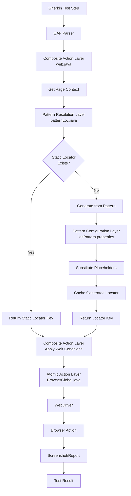
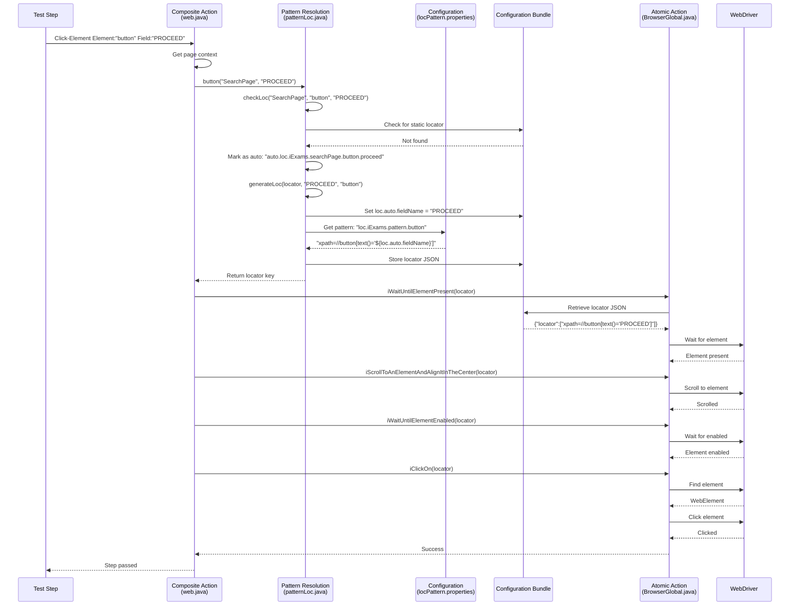
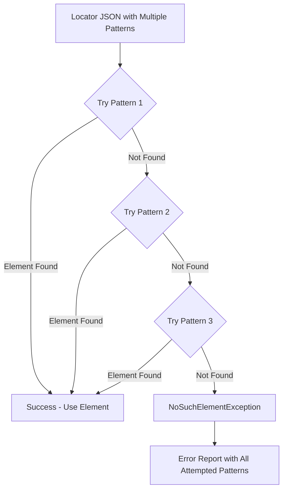
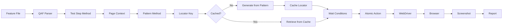
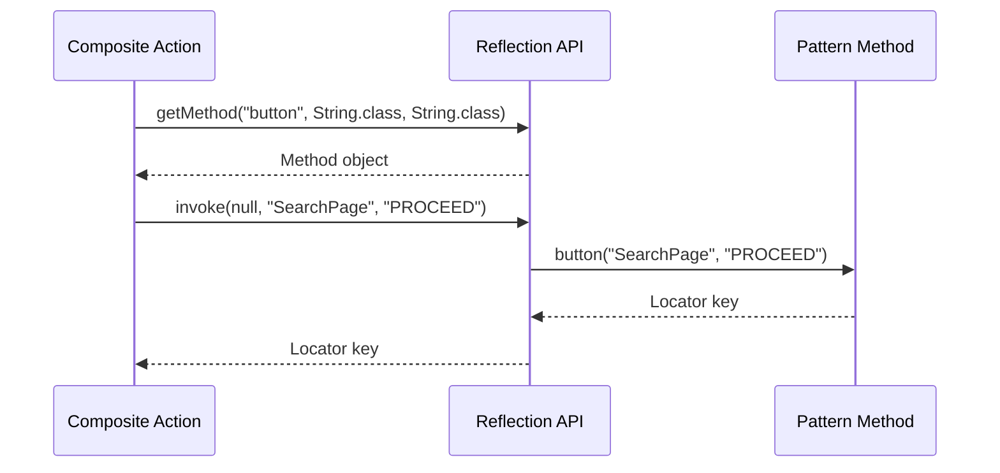
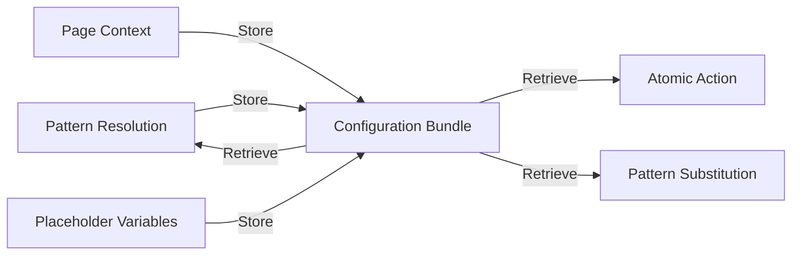
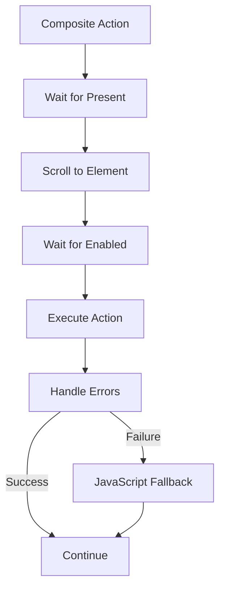
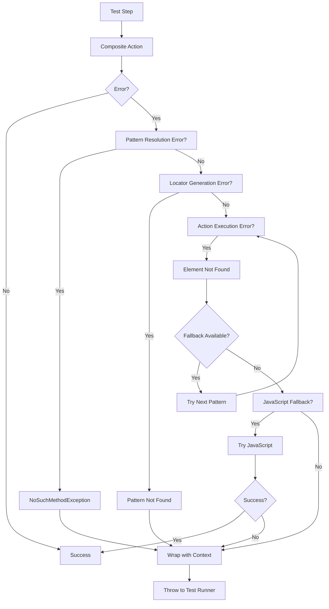

# Data Flow and Execution Documentation

## Overview

This document provides a comprehensive view of how data flows through the pattern-based locator system, from test step execution to browser action. Understanding these flows is essential for debugging, extending, and implementing similar systems in other frameworks.

## Complete Test Execution Flow

### High-Level Flow Diagram



### Step-by-Step Execution

Let's trace a complete execution with a concrete example:

**Test Step**: `When Web: Click-Element Element:"button" Field:"PROCEED"`


#### Step 1: Test Step Parsing

**Input**: Gherkin step from feature file
```gherkin
When Web: Click-Element Element:"button" Field:"PROCEED"
```

**QAF Parser Action**:
- Matches step pattern: `"Web: Click-Element Element:{string} Field:{string}"`
- Extracts parameters: `element_name = "button"`, `field_link_name = "PROCEED"`
- Invokes method: `web.clickElement_Web("button", "PROCEED")`

**Output**: Method invocation with parameters

---

#### Step 2: Composite Action Execution

**Location**: `web.java`

**Method**: `clickElement_Web(String element_name, String field_link_name)`

**Code**:
```java
@QAFTestStep(description = "Web: Click-Element Element:{element_name} Field:{field_link_name}")
public static void clickElement_Web(String element_name, String field_link_name) throws Exception {
    Class<?> patternLocClass = patternLoc.class;
    try {
        // Get pattern method using reflection
        Method method = patternLocClass.getMethod(element_name, String.class, String.class);
        Reporter.log("Found function " + element_name + " in patternLoc.java!");
        
        // Get current page context
        String currentPage = getPageName();  // Returns: "SearchPage"
        
        // Invoke pattern method
        Object result = method.invoke(null, currentPage, field_link_name);
        String locator = (String) result;
        
        // Apply wait conditions and execute action
        BrowserGlobal.iClickOn(waitForFieldToBePresentScrollToCenterViewAndEnabled(locator));
        
    } catch (NoSuchMethodException e) {
        throw new Exception("No such method: " + element_name + " in patternLoc", e);
    }
}
```

**Actions**:
1. Use reflection to find `patternLoc.button()` method
2. Get current page name: `"SearchPage"`
3. Invoke: `patternLoc.button("SearchPage", "PROCEED")`
4. Receive locator key
5. Apply wait conditions
6. Execute click action

**Output**: Locator key ready for action execution

---

#### Step 3: Pattern Resolution

**Location**: `patternLoc.java`

**Method**: `button(String page, String fieldName)`

**Code**:
```java
public static String button(String page, String fieldName) throws Exception {
    String fieldType = "button";
    String locator = checkLoc(page, fieldType, fieldName);
    if (locator.contains("auto.")) {
        generateLoc(locator, fieldName, fieldType);
    }
    return locator;
}
```

**Actions**:
1. Set field type: `"button"`
2. Call `checkLoc("SearchPage", "button", "PROCEED")`
3. Check if locator needs generation (contains "auto.")
4. If yes, call `generateLoc()`
5. Return locator key

**Output**: Locator key (static or auto-generated)

---

#### Step 4: Locator Key Generation

**Location**: `patternLoc.java`

**Method**: `checkLoc(String argPageName, String argFieldType, String argFieldName)`

**Code**:
```java
public static String checkLoc(String argPageName, String argFieldType, String argFieldName) {
    // Clear previous state
    getBundle().setProperty("loc.auto.fieldName","");
    getBundle().setProperty("loc.auto.fieldInstance","");
    
    // Get pattern code
    String patternCode = getPatternCode();  // "loc.iExams"
    
    // Generate locator key
    String locName = patternCode + "." + 
        CaseUtils.toCamelCase(argPageName.replaceAll("[^a-zA-Z0-9]", " "), false, ' ') + "." + 
        CaseUtils.toCamelCase(argFieldType.replaceAll("[^a-zA-Z0-9]", " "), false, ' ') + "." + 
        CaseUtils.toCamelCase(argFieldName.replaceAll("[^a-zA-Z0-9]", " "), false, ' ');
    
    // Check if static locator exists
    String locVal = getBundle().getPropertyValue(locName);
    if (locVal.equals(locName) || locVal.length() < 5) {
        locName = "auto." + locName;
    }
    
    return locName;
}
```

**Process**:
```
Input:
  - Page: "SearchPage"
  - Element: "button"
  - Field: "PROCEED"

Step 1: Clear placeholder variables
  - loc.auto.fieldName = ""
  - loc.auto.fieldInstance = ""

Step 2: Get pattern code
  - Result: "loc.iExams"

Step 3: Generate key components
  - Page (camelCase): "searchPage"
  - Element (camelCase): "button"
  - Field (camelCase): "proceed"

Step 4: Construct key
  - Result: "loc.iExams.searchPage.button.proceed"

Step 5: Check for static locator
  - Look up: "loc.iExams.searchPage.button.proceed"
  - Not found in properties

Step 6: Mark as auto-generated
  - Result: "auto.loc.iExams.searchPage.button.proceed"
```

**Output**: `"auto.loc.iExams.searchPage.button.proceed"`

---

#### Step 5: Pattern-Based Locator Generation

**Location**: `patternLoc.java`

**Method**: `generateLoc(String argLocator, String argFieldName, String argFieldType)`

**Code**:
```java
public static void generateLoc(String argLocator, String argFieldName, String argFieldType) {
    String patternCodeVal = getPatternCode();
    
    // Set placeholder variables
    getBundle().setProperty("loc.auto.fieldName", fieldNameCheck(argFieldName));
    getBundle().setProperty("loc.auto.fieldInstance", fieldInstanceCheck(argFieldName));
    
    // Build pattern key
    String locPattern = patternCodeVal + ".pattern." + argFieldType;
    
    // Get pattern template
    String locPatternVal = getBundle().getPropertyValue(locPattern);
    
    // Validate pattern exists
    if (locPatternVal.equals(locPattern) || locPatternVal.length() < 5) {
        System.out.println("=====>[ERROR] => [Locator Pattern '"+ locPattern + "' not available]");
    }
    
    // Generate and store locator JSON
    getBundle().setProperty(argLocator, 
        "{\"locator\":[" + locPatternVal + "],\"desc\":\"" + argFieldName + " : [" + argFieldType + "] Field \"}");
    
    // Log if enabled
    if (getBundle().getPropertyValue("loc.pattern.log").trim().equalsIgnoreCase("true")) {
        System.out.println("==== AUTO GENERATED: LOCATOR (Pattern) ====> " + argLocator + 
            "=" + getBundle().getPropertyValue(argLocator));
    }
}
```

**Process**:
```
Input:
  - Locator Key: "auto.loc.iExams.searchPage.button.proceed"
  - Field Name: "PROCEED"
  - Element Type: "button"

Step 1: Set placeholder variables
  - loc.auto.fieldName = "PROCEED"
  - loc.auto.fieldInstance = "1"

Step 2: Build pattern key
  - Result: "loc.iExams.pattern.button"

Step 3: Retrieve pattern template from locPattern.properties
  - Pattern: "xpath=//button[text()='${loc.auto.fieldName}']",
            "xpath=//span[text()='${loc.auto.fieldName}']"

Step 4: Create locator JSON
  - JSON: {
      "locator": [
        "xpath=//button[text()='${loc.auto.fieldName}']",
        "xpath=//span[text()='${loc.auto.fieldName}']"
      ],
      "desc": "PROCEED : [button] Field "
    }

Step 5: Store in configuration bundle
  - Key: "auto.loc.iExams.searchPage.button.proceed"
  - Value: JSON locator object

Step 6: Log (if enabled)
  - Console: "==== AUTO GENERATED: LOCATOR (Pattern) ====> ..."
```

**Output**: Locator stored in bundle, ready for use


---

#### Step 6: Wait Conditions Application

**Location**: `web.java`

**Method**: `waitForFieldToBePresentScrollToCenterViewAndEnabled(String locName)`

**Code**:
```java
public static String waitForFieldToBePresentScrollToCenterViewAndEnabled(String locName) throws Exception {
    BrowserGlobal.iWaitUntilElementPresent(locName);
    BrowserGlobal.iScrollToAnElementAndAlignItInTheCenter(locName);
    BrowserGlobal.iWaitUntilElementEnabled(locName);
    return locName;
}
```

**Process**:
```
Input: "auto.loc.iExams.searchPage.button.proceed"

Step 1: Wait for element to be present in DOM
  - BrowserGlobal.iWaitUntilElementPresent(locator)
  - WebDriver waits up to configured timeout

Step 2: Scroll element into view (centered)
  - BrowserGlobal.iScrollToAnElementAndAlignItInTheCenter(locator)
  - JavaScript: scrollIntoView({block: 'center'})

Step 3: Wait for element to be enabled
  - BrowserGlobal.iWaitUntilElementEnabled(locator)
  - WebDriver waits for enabled state

Output: Same locator key (for method chaining)
```

**Output**: Locator key, element ready for interaction

---

#### Step 7: Atomic Action Execution

**Location**: `BrowserGlobal.java`

**Method**: `iClickOn(String locator)`

**Code**:
```java
@QAFTestStep(description = "I click on {locator}")
public static void iClickOn(String locator) throws Exception {
    try {
        click(locator);
    } catch (Exception e) {
        if(e.getClass().toString().contains("ElementClickInterceptedException") ||
           e.getClass().toString().contains("ElementNotInteractableException")) {
            WebElement elementLocator = new WebDriverTestBase().getDriver().findElement(locator);
            WebDriver driver = new WebDriverTestBase().getDriver();
            JavascriptExecutor js = (JavascriptExecutor)driver;
            js.executeScript("arguments[0].click();", elementLocator);
        }
    }
}
```

**Process**:
```
Input: "auto.loc.iExams.searchPage.button.proceed"

Step 1: Retrieve locator from bundle
  - Key: "auto.loc.iExams.searchPage.button.proceed"
  - Value: {"locator":["xpath=//button[text()='PROCEED']", ...]}

Step 2: Parse JSON locator
  - Extract locator array
  - First locator: "xpath=//button[text()='PROCEED']"

Step 3: Substitute placeholders (by QAF)
  - ${loc.auto.fieldName} → "PROCEED"
  - Result: "xpath=//button[text()='PROCEED']"

Step 4: Find element
  - WebDriver.findElement(By.xpath("//button[text()='PROCEED']"))

Step 5: Attempt click
  - Try: element.click()
  - If fails: JavaScript fallback

Step 6: Execute click
  - Standard click or JavaScript click
```

**Output**: Element clicked successfully

---

#### Step 8: Reporting and Result

**Actions**:
1. Screenshot captured (if configured)
2. Action logged in test report
3. Test step marked as passed/failed
4. Execution continues to next step

**Output**: Test result recorded


## Locator Resolution Flow Diagram

### Detailed Sequence Diagram



### Flow Explanation

1. **Test Step → Composite Action**: QAF parser invokes composite action method
2. **Composite Action → Pattern Resolution**: Uses reflection to call pattern method
3. **Pattern Resolution → Configuration Bundle**: Checks for existing locator
4. **Pattern Resolution → Configuration**: Retrieves pattern template
5. **Pattern Resolution → Configuration Bundle**: Stores generated locator
6. **Composite Action → Atomic Actions**: Applies wait conditions
7. **Atomic Actions → WebDriver**: Executes browser actions
8. **Result Propagation**: Success/failure flows back through layers


## Pattern Fallback Mechanism

### How Fallback Works

When multiple patterns are defined for an element type, the system tries each pattern in sequence until one succeeds.

### Fallback Flow Diagram



### Example: Button with Fallback Patterns

**Pattern Configuration**:
```properties
loc.iExams.pattern.button = \
  "xpath=//button[text()='${loc.auto.fieldName}']",\
  "xpath=//span[text()='${loc.auto.fieldName}']",\
  "xpath=//button[@label='${loc.auto.fieldName}']",\
  "xpath=//button[contains(text(),'${loc.auto.fieldName}')]"
```

**Generated Locator JSON**:
```json
{
  "locator": [
    "xpath=//button[text()='PROCEED']",
    "xpath=//span[text()='PROCEED']",
    "xpath=//button[@label='PROCEED']",
    "xpath=//button[contains(text(),'PROCEED')]"
  ],
  "desc": "PROCEED : [button] Field "
}
```

**Execution Flow**:
```
Step 1: Try first pattern
  - Locator: "xpath=//button[text()='PROCEED']"
  - WebDriver.findElement(By.xpath("//button[text()='PROCEED']"))
  - Result: NoSuchElementException

Step 2: Try second pattern
  - Locator: "xpath=//span[text()='PROCEED']"
  - WebDriver.findElement(By.xpath("//span[text()='PROCEED']"))
  - Result: Element found! ✓

Step 3: Use found element
  - Perform click action
  - Success
```

### Fallback Benefits

1. **Increased Reliability**: Tests don't fail due to minor UI changes
2. **Framework Flexibility**: Handles different UI frameworks
3. **Version Compatibility**: Works across application versions
4. **Reduced Maintenance**: Fewer locator updates needed

### Fallback Best Practices

1. **Order by Specificity**: Most specific patterns first
2. **Limit Fallbacks**: 3-5 patterns maximum
3. **Test All Patterns**: Ensure each pattern is valid
4. **Document Patterns**: Explain why each fallback exists


## Complete Lifecycle: Test Step to Browser Action

### Lifecycle Diagram



### Detailed Lifecycle Steps

#### Phase 1: Test Definition
```gherkin
# Feature file: 01_CEM_PC.feature
Scenario: Search Paper Configuration
  Given Web: Set-Page-Name Value:"PaperConfiguration"
  When Web: Click-Element Element:"button" Field:"Search"
```

#### Phase 2: Test Execution Start
- TestNG/Cucumber runner starts
- QAF framework initializes
- Configuration bundle loaded
- WebDriver session created

#### Phase 3: Step Parsing
- QAF parser reads Gherkin step
- Matches step pattern
- Extracts parameters
- Invokes Java method

#### Phase 4: Context Resolution
- Get current page name from bundle
- Page context: "PaperConfiguration"

#### Phase 5: Pattern Resolution
- Use reflection to find pattern method
- Invoke: `patternLoc.button("PaperConfiguration", "Search")`
- Generate locator key
- Check cache

#### Phase 6: Locator Generation (if not cached)
- Retrieve pattern template
- Substitute placeholders
- Create locator JSON
- Store in cache

#### Phase 7: Wait Orchestration
- Wait for element present
- Scroll to element
- Wait for element enabled

#### Phase 8: Action Execution
- Retrieve locator from cache
- Parse JSON locator
- Try each pattern (fallback)
- Execute browser action

#### Phase 9: Result Reporting
- Capture screenshot
- Log action result
- Update test report
- Continue to next step

#### Phase 10: Test Completion
- All steps executed
- Final report generated
- WebDriver session closed
- Test result recorded


## Data Flow Examples

### Example 1: First-Time Locator Generation

**Scenario**: Locator doesn't exist in cache

```
Input: Click-Element Element:"button" Field:"Submit"
Page Context: "RegistrationForm"

Flow:
1. checkLoc("RegistrationForm", "button", "Submit")
   └─> Key: "loc.iExams.registrationForm.button.submit"

2. Check cache
   └─> Not found

3. Mark as auto
   └─> Key: "auto.loc.iExams.registrationForm.button.submit"

4. generateLoc()
   ├─> Get pattern: "loc.iExams.pattern.button"
   ├─> Pattern: "xpath=//button[text()='${loc.auto.fieldName}']"
   ├─> Substitute: "xpath=//button[text()='Submit']"
   └─> Store in cache

5. Execute action
   └─> Click on "xpath=//button[text()='Submit']"

Result: Locator generated and cached
```

### Example 2: Cached Locator Reuse

**Scenario**: Locator already exists in cache

```
Input: Click-Element Element:"button" Field:"Submit"
Page Context: "RegistrationForm"

Flow:
1. checkLoc("RegistrationForm", "button", "Submit")
   └─> Key: "loc.iExams.registrationForm.button.submit"

2. Check cache
   └─> Found! (from previous execution)

3. Return cached key
   └─> Key: "auto.loc.iExams.registrationForm.button.submit"

4. Skip generation (already cached)

5. Execute action
   └─> Click on cached locator

Result: Fast execution using cached locator
```

### Example 3: Static Locator Priority

**Scenario**: Static locator defined in properties file

```
# In locators/lhub.loc
loc.iExams.registrationForm.button.submit = xpath=//button[@id='submit-btn']

Input: Click-Element Element:"button" Field:"Submit"
Page Context: "RegistrationForm"

Flow:
1. checkLoc("RegistrationForm", "button", "Submit")
   └─> Key: "loc.iExams.registrationForm.button.submit"

2. Check for static locator
   └─> Found in properties!

3. Return static key (no "auto." prefix)
   └─> Key: "loc.iExams.registrationForm.button.submit"

4. Skip pattern generation

5. Execute action
   └─> Click on "xpath=//button[@id='submit-btn']"

Result: Static locator used (takes precedence)
```

### Example 4: Hierarchical Context

**Scenario**: Using page::location context

```
Input: Input-Text Value:"John" Field:"First Name"
Page Context: "UserProfile::PersonalInfo"

Flow:
1. checkLoc("UserProfile::PersonalInfo", "input", "First Name")
   └─> Key: "loc.iExams.userProfile::personalInfo.input.firstName"

2. Check cache
   └─> Not found

3. Mark as auto
   └─> Key: "auto.loc.iExams.userProfile::personalInfo.input.firstName"

4. generateLoc()
   ├─> Get pattern: "loc.iExams.pattern.input"
   ├─> Pattern: "xpath=//input[@placeholder='${loc.auto.fieldName}']"
   ├─> Substitute: "xpath=//input[@placeholder='First Name']"
   └─> Store in cache

5. Execute action
   └─> Input "John" into field

Result: Locator scoped to PersonalInfo section
```


## Component Interaction Patterns

### Pattern 1: Reflection-Based Invocation



**Benefits**:
- Dynamic method lookup
- No hardcoded method calls
- Extensible without code changes

### Pattern 2: Configuration Bundle Communication



**Key Properties**:
- `auto.page.name`: Current page context
- `loc.auto.fieldName`: Current field name
- `loc.auto.fieldInstance`: Field instance number
- `auto.loc.{key}`: Generated locator JSON

### Pattern 3: Wait + Action Orchestration



**Sequence**:
1. Ensure element exists in DOM
2. Bring element into viewport
3. Ensure element is interactable
4. Perform action
5. Handle exceptions with fallback


## Performance Considerations

### Caching Impact

**First Execution** (No Cache):
```
Time: ~500ms
Steps:
  - Pattern resolution: 50ms
  - Pattern retrieval: 20ms
  - Placeholder substitution: 10ms
  - Cache storage: 10ms
  - Wait conditions: 300ms
  - Action execution: 110ms
```

**Subsequent Execution** (Cached):
```
Time: ~420ms
Steps:
  - Cache retrieval: 5ms
  - Wait conditions: 300ms
  - Action execution: 115ms

Savings: ~80ms per action
```

### Optimization Strategies

1. **Locator Caching**: Reduces pattern resolution overhead
2. **Smart Waits**: Only wait when necessary
3. **Batch Operations**: Group related actions
4. **Pattern Simplicity**: Simpler XPath = faster finding

### Bottlenecks

1. **Wait Conditions**: Largest time consumer (necessary for reliability)
2. **Element Finding**: Depends on DOM complexity
3. **Pattern Resolution**: First-time generation overhead
4. **Reflection**: Minimal overhead (~1-2ms)

## Error Propagation

### Error Flow Diagram



### Error Context Enrichment

Each layer adds context to errors:

**Pattern Resolution Layer**:
```
Error: NoSuchMethodException: customElement
Context Added:
  - Element Type: customElement
  - Field Name: MyField
  - Page: SearchPage
```

**Composite Action Layer**:
```
Error: Element not found
Context Added:
  - Test Step: Click-Element Element:button Field:PROCEED
  - Locator Key: auto.loc.iExams.searchPage.button.proceed
```

**Atomic Action Layer**:
```
Error: NoSuchElementException
Context Added:
  - Attempted Patterns:
    1. xpath=//button[text()='PROCEED']
    2. xpath=//span[text()='PROCEED']
    3. xpath=//button[@label='PROCEED']
```

## Requirements Validation

This documentation addresses the following requirements:

### Requirement 2.1-2.6: Dynamic Locator Generation
✅ **Documented**: Complete flow from test step to generated locator

### Requirement 7.1-7.5: Pattern Fallback Mechanism
✅ **Documented**: Fallback flow with diagrams and examples

### Requirements 2.1-2.6, 7.1-7.5: Complete Lifecycle
✅ **Documented**: End-to-end flow from test step to browser action

## Summary

The Data Flow and Execution documentation provides a comprehensive view of how the pattern-based locator system operates:

### Key Flows

1. **Test Execution Flow**: From Gherkin step to browser action
2. **Locator Resolution Flow**: From field name to XPath selector
3. **Pattern Fallback Flow**: Multiple patterns tried in sequence
4. **Complete Lifecycle**: All phases from definition to reporting

### Critical Components

- **QAF Parser**: Converts Gherkin to method calls
- **Reflection API**: Dynamic pattern method invocation
- **Configuration Bundle**: Central data storage
- **Pattern Templates**: Reusable locator patterns
- **Wait Orchestration**: Ensures element readiness
- **Fallback Mechanism**: Increases reliability

### Performance Characteristics

- **First Execution**: ~500ms (with pattern generation)
- **Cached Execution**: ~420ms (cache retrieval)
- **Bottleneck**: Wait conditions (necessary for reliability)
- **Optimization**: Caching reduces overhead by ~80ms

### Error Handling

- **Context Enrichment**: Each layer adds debugging information
- **Automatic Fallbacks**: JavaScript executor for problematic elements
- **Pattern Fallbacks**: Multiple locators tried in sequence
- **Clear Messages**: Detailed error context for debugging

This comprehensive flow documentation enables developers to understand, debug, and extend the pattern-based locator system effectively.
