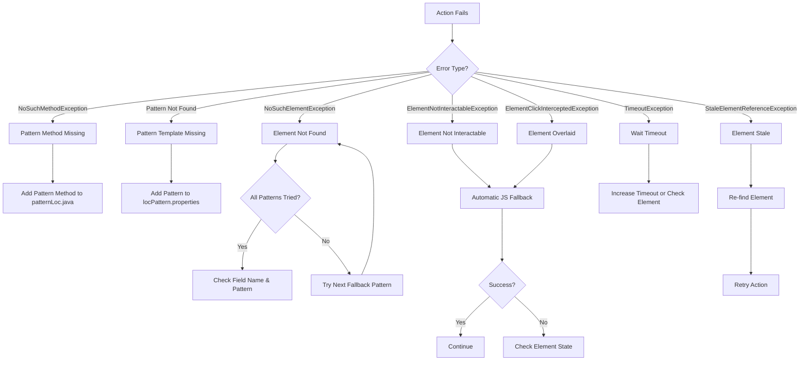

# Error Handling Strategies Documentation

## Overview

Error handling is a critical aspect of the pattern-based locator system that ensures tests fail gracefully with meaningful error messages and provides automatic recovery mechanisms where possible. This document covers all error scenarios, detection mechanisms, recovery strategies, and the JavaScript executor fallback pattern.

## Error Categories

The pattern-based locator system handles errors at multiple layers, each with specific detection and recovery strategies:

1. **Configuration Errors**: Missing or invalid configuration
2. **Pattern Resolution Errors**: Pattern methods or templates not found
3. **Locator Generation Errors**: Issues during locator creation
4. **Element Finding Errors**: Elements not found or not interactable
5. **Action Execution Errors**: Failures during browser actions

## Configuration Errors

### Error 1: Missing Pattern Code

**Scenario**: Pattern code not configured in application.properties

**Detection**:
```java
public static String getPatternCode() {
    String patternCodeVal = getBundle().getPropertyValue("loc.pattern.code");
    if (patternCodeVal.equals("loc.pattern.code")) {
        System.out.println("=====>[ERROR] => [Locator Pattern Code missing in project config or not assigned during execution]");
    }
    return patternCodeVal;
}
```

**Error Message**:
```
=====>[ERROR] => [Locator Pattern Code missing in project config or not assigned during execution]
```

**Cause**:
- Property `loc.pattern.code` not defined in `application.properties`
- Property value is empty or null

**Impact**:
- All pattern-based locators will fail
- Locator keys will be malformed
- Tests cannot execute

**Recovery Strategy**:
```properties
# Add to resources/application.properties
loc.pattern.code=loc.iExams
```

**Prevention**:
- Validate configuration at framework initialization
- Include in project setup documentation
- Add to CI/CD validation checks


### Error 2: Missing Pattern Template

**Scenario**: Pattern template not defined in locPattern.properties

**Detection**:
```java
public static void generateLoc(String argLocator, String argFieldName, String argFieldType) {
    String locPattern = patternCodeVal + ".pattern." + argFieldType;
    String locPatternVal = getBundle().getPropertyValue(locPattern);
    
    if (locPatternVal.equals(locPattern) || locPatternVal.length() < 5) {
        System.out.println("=====>[ERROR] => [Locator Pattern '"+ locPattern + "' not available]");
    }
}
```

**Error Message**:
```
=====>[ERROR] => [Locator Pattern 'loc.iExams.pattern.customElement' not available]
```

**Cause**:
- Pattern template not defined for the element type
- Typo in element type name
- Pattern file not loaded

**Impact**:
- Locator generation fails for that element type
- Empty or invalid locator created
- Element cannot be found

**Recovery Strategy**:
```properties
# Add to resources/locators/locPattern.properties
loc.iExams.pattern.customElement = \
  "xpath=//custom-element[@label='${loc.auto.fieldName}']",\
  "xpath=//div[@data-field='${loc.auto.fieldName}']"
```

**Prevention**:
- Create pattern templates for all element types used
- Validate pattern file completeness
- Use consistent element type naming

**Example**:
```gherkin
# This will fail if pattern not defined
When Web: Click-Element Element:"customElement" Field:"MyField"

# Error logged:
# [ERROR] => [Locator Pattern 'loc.iExams.pattern.customElement' not available]
```

## Pattern Resolution Errors

### Error 3: Pattern Method Not Found

**Scenario**: No pattern method exists for the specified element type

**Detection**:
```java
try {
    Method method = patternLocClass.getMethod(element_name, String.class, String.class);
    Object result = method.invoke(null, getPageName(), field_link_name);
} catch (NoSuchMethodException e) {
    throw new Exception("No such method: " + element_name + " in patternLoc", e);
}
```

**Error Message**:
```
No such method: customElement in patternLoc
  Element Type: customElement
  Field Name: MyField
  Page: SearchPage
```

**Cause**:
- Pattern method not implemented in patternLoc.java
- Typo in element type name
- Method signature doesn't match expected pattern

**Impact**:
- Test step fails immediately
- Clear error message indicates missing method
- No locator resolution attempted

**Recovery Strategy**:
```java
// Add to patternLoc.java
public static String customElement(String page, String fieldName) throws Exception {
    String fieldType = "customElement";
    String locator = checkLoc(page, fieldType, fieldName);
    if (locator.contains("auto.")) {
        generateLoc(locator, fieldName, fieldType);
    }
    return locator;
}
```

**Prevention**:
- Implement pattern methods for all element types
- Use code generation for standard pattern methods
- Maintain element type registry

**Example**:
```gherkin
# This will fail if method not implemented
When Web: Click-Element Element:"customElement" Field:"MyField"

# Error thrown:
# No such method: customElement in patternLoc
```


### Error 4: Reflection Invocation Failure

**Scenario**: Pattern method exists but invocation fails

**Detection**:
```java
try {
    Method method = patternLocClass.getMethod(element_name, String.class, String.class);
    Object result = method.invoke(null, getPageName(), field_link_name);
} catch (NoSuchMethodException e) {
    throw new Exception("No such method: " + element_name + " in patternLoc", e);
} catch (Exception e) {
    throw new Exception("Error invoking method: " + element_name, e);
}
```

**Error Message**:
```
Error invoking method: button
  Element Type: button
  Field Name: PROCEED
  Page: SearchPage
  Cause: [underlying exception details]
```

**Causes**:
- Exception thrown inside pattern method
- Invalid parameters passed
- Configuration bundle access failure
- Pattern generation error

**Impact**:
- Test step fails with wrapped exception
- Original error preserved in stack trace
- Context added for debugging

**Recovery Strategy**:
- Check pattern method implementation
- Verify configuration bundle state
- Review pattern template syntax
- Check for null values

**Prevention**:
- Add error handling in pattern methods
- Validate inputs before processing
- Use defensive programming practices

## Element Finding Errors

### Error 5: Element Not Found (NoSuchElementException)

**Scenario**: Element doesn't exist on the page

**Detection**:
```java
WebDriver.findElement(locator)
// Throws: NoSuchElementException
```

**Error Message**:
```
NoSuchElementException: Unable to locate element
  Locator: xpath=//button[text()='PROCEED']
  Element Type: button
  Field Name: PROCEED
  Page: SearchPage
  
Attempted Patterns:
  1. xpath=//button[text()='PROCEED']
  2. xpath=//span[text()='PROCEED']
  3. xpath=//button[@label='PROCEED']
```

**Causes**:
- Element doesn't exist on the page
- Incorrect locator pattern
- Page not fully loaded
- Element in different iframe
- Field name doesn't match UI text

**Impact**:
- Test step fails
- All fallback patterns attempted
- Screenshot captured for debugging

**Recovery Strategies**:

1. **Add Wait Condition**:
```gherkin
When Web: Wait-Until-Element-Present Element:"button" Field:"PROCEED"
And Web: Click-Element Element:"button" Field:"PROCEED"
```

2. **Verify Pattern Template**:
```properties
# Check pattern matches actual HTML
loc.iExams.pattern.button = "xpath=//button[text()='${loc.auto.fieldName}']"
```

3. **Check Field Name**:
```gherkin
# Ensure field name matches UI exactly
When Web: Click-Element Element:"button" Field:"PROCEED"
# UI shows: "Proceed" (different case!)
```

4. **Add More Fallback Patterns**:
```properties
loc.iExams.pattern.button = \
  "xpath=//button[text()='${loc.auto.fieldName}']",\
  "xpath=//button[contains(text(),'${loc.auto.fieldName}')]",\
  "xpath=//span[text()='${loc.auto.fieldName}']",\
  "xpath=//button[@label='${loc.auto.fieldName}']",\
  "xpath=//button[@aria-label='${loc.auto.fieldName}']"
```

**Prevention**:
- Use case-insensitive patterns where appropriate
- Add multiple fallback patterns
- Verify field names match UI text
- Use wait conditions before actions


### Error 6: Element Not Interactable (ElementNotInteractableException)

**Scenario**: Element exists but cannot be interacted with

**Detection**:
```java
element.click()
// Throws: ElementNotInteractableException
```

**Error Message**:
```
ElementNotInteractableException: element not interactable
  Locator: xpath=//button[@id='submit']
  Element Type: button
  Field Name: Submit
  Page: RegistrationForm
```

**Causes**:
- Element is hidden (display: none, visibility: hidden)
- Element is disabled
- Element is behind another element
- Element is outside viewport
- Element hasn't finished rendering

**Impact**:
- Standard click fails
- Automatic JavaScript fallback triggered
- Action may succeed via JavaScript

**Automatic Recovery**:
```java
@QAFTestStep(description = "I click on {locator}")
public static void iClickOn(String locator) throws Exception {
    try {
        click(locator);
    } catch (Exception e) {
        if(e.getClass().toString().contains("ElementNotInteractableException")) {
            // Automatic JavaScript fallback
            WebElement elementLocator = new WebDriverTestBase().getDriver().findElement(locator);
            JavascriptExecutor js = (JavascriptExecutor)driver;
            js.executeScript("arguments[0].click();", elementLocator);
        }
    }
}
```

**Manual Recovery Strategies**:

1. **Wait for Element to be Enabled**:
```gherkin
When Web: Wait-Until-Element-Enabled Element:"button" Field:"Submit"
And Web: Click-Element Element:"button" Field:"Submit"
```

2. **Scroll Element into View**:
```gherkin
When Web: Scroll-To-Element Element:"button" Field:"Submit"
And Web: Click-Element Element:"button" Field:"Submit"
```

3. **Use JavaScript Executor Explicitly**:
```gherkin
When Web: JavaScript-Executor-Click-Element Element:"button" Field:"Submit"
```

**Prevention**:
- Use composite actions that include wait conditions
- Scroll elements into view before interaction
- Wait for page load completion
- Check element state before action

### Error 7: Element Click Intercepted (ElementClickInterceptedException)

**Scenario**: Another element overlays the target element

**Detection**:
```java
element.click()
// Throws: ElementClickInterceptedException
```

**Error Message**:
```
ElementClickInterceptedException: Element is not clickable at point (x, y). Other element would receive the click
  Locator: xpath=//button[@id='submit']
  Element Type: button
  Field Name: Submit
  Intercepting Element: <div class="modal-overlay">
```

**Causes**:
- Modal or overlay covering element
- Loading spinner still visible
- Dropdown menu open
- Tooltip or popup in the way
- Z-index stacking issue

**Impact**:
- Standard click fails
- Automatic JavaScript fallback triggered
- Action may succeed via JavaScript

**Automatic Recovery**:
```java
// Same automatic fallback as ElementNotInteractableException
if(e.getClass().toString().contains("ElementClickInterceptedException")) {
    JavascriptExecutor js = (JavascriptExecutor)driver;
    js.executeScript("arguments[0].click();", elementLocator);
}
```

**Manual Recovery Strategies**:

1. **Wait for Overlay to Disappear**:
```gherkin
When Web: Wait-Until-Element-Not-Visible Element:"spinner" Field:"loadWrapper"
And Web: Click-Element Element:"button" Field:"Submit"
```

2. **Close Modal First**:
```gherkin
When Web: Click-Element Element:"button" Field:"Close Modal"
And Web: Click-Element Element:"button" Field:"Submit"
```

3. **Use JavaScript Executor**:
```gherkin
When Web: JavaScript-Executor-Click-Element Element:"button" Field:"Submit"
```

**Prevention**:
- Wait for loading indicators to disappear
- Close modals/overlays before proceeding
- Use JavaScript executor for problematic elements
- Add explicit waits for page stability


### Error 8: Stale Element Reference (StaleElementReferenceException)

**Scenario**: Element was found but DOM changed before interaction

**Detection**:
```java
element.click()
// Throws: StaleElementReferenceException
```

**Error Message**:
```
StaleElementReferenceException: stale element reference: element is not attached to the page document
  Locator: xpath=//button[@id='submit']
  Element Type: button
  Field Name: Submit
```

**Causes**:
- Page refreshed after element was found
- DOM updated via JavaScript
- AJAX request modified page structure
- Element removed and re-added to DOM
- Navigation occurred

**Impact**:
- Action fails on stale element
- Need to re-find element
- May require retry logic

**Recovery Strategy**:
```java
// Retry with fresh element lookup
try {
    element.click();
} catch (StaleElementReferenceException e) {
    // Re-find element
    WebElement freshElement = driver.findElement(locator);
    freshElement.click();
}
```

**Prevention**:
- Find element immediately before use
- Don't store WebElement references
- Use locator strings instead of WebElement objects
- Add waits after page changes

**Example**:
```gherkin
# Bad: Element may become stale
When Web: Wait-For-Page-To-Load
And Web: Wait for "5000" milliseconds
And Web: Click-Element Element:"button" Field:"Submit"

# Good: Fresh lookup each time
When Web: Wait-For-Page-To-Load
And Web: Click-Element Element:"button" Field:"Submit"
```

## JavaScript Executor Fallback Pattern

### Overview

The JavaScript Executor fallback is an automatic recovery mechanism that executes actions via JavaScript when standard Selenium actions fail.

### Implementation

**Automatic Fallback in iClickOn()**:
```java
@QAFTestStep(description = "I click on {locator}")
public static void iClickOn(String locator) throws Exception {
    try {
        // Try standard Selenium click
        click(locator);
        
    } catch (Exception e) {
        // Check if it's a known recoverable exception
        if(e.getClass().toString().contains("ElementClickInterceptedException") ||
           e.getClass().toString().contains("ElementNotInteractableException")) {
            
            // Fallback to JavaScript click
            WebElement elementLocator = new WebDriverTestBase().getDriver().findElement(locator);
            WebDriver driver = new WebDriverTestBase().getDriver();
            JavascriptExecutor js = (JavascriptExecutor)driver;
            js.executeScript("arguments[0].click();", elementLocator);
        } else {
            // Re-throw if not recoverable
            throw e;
        }
    }
}
```

### When JavaScript Executor is Used

**Automatic Triggers**:
1. `ElementClickInterceptedException` - Element overlaid
2. `ElementNotInteractableException` - Element not interactable

**Manual Usage**:
```gherkin
# Explicit JavaScript executor steps
When Web: JavaScript-Executor-Click-Element Element:"button" Field:"Submit"
And Web: JavaScript-Executor-Clear-Element Element:"input" Field:"Search"
```

### JavaScript Executor Actions

#### 1. JavaScript Click

**Implementation**:
```java
@QAFTestStep(description = "Web: JavaScript-Executor-Click-Element Element:{element_name} Field:{field_link_name}")
public static void javaScriptExecutorClickElement(String element_name, String field_link_name) throws Exception {
    iWaitForPageToLoad();
    
    // Resolve locator via pattern
    Class<?> patternLocClass = patternLoc.class;
    Method method = patternLocClass.getMethod(element_name, String.class, String.class);
    Object result = method.invoke(null, getPageName(), field_link_name);
    
    // Find element
    WebElement elementToClick = new WebDriverTestBase().getDriver().findElement((String) result);
    
    // Execute JavaScript click
    WebDriver driver = new WebDriverTestBase().getDriver();
    JavascriptExecutor js = (JavascriptExecutor) driver;
    js.executeScript("arguments[0].click();", elementToClick);
}
```

**JavaScript Code**: `arguments[0].click();`

**Use Cases**:
- Element covered by overlay
- Framework-specific UI components
- Elements with complex event handlers
- Disabled elements that need to be clicked

#### 2. JavaScript Clear

**Implementation**:
```java
@QAFTestStep(description = "Web: JavaScript-Executor-Clear-Element Element:{element_name} Field:{field_link_name}")
public static void javaScriptExecutorClearElement(String element_name, String field_link_name) throws Exception {
    iWaitForPageToLoad();
    
    // Resolve and find element
    Class<?> patternLocClass = patternLoc.class;
    Method method = patternLocClass.getMethod(element_name, String.class, String.class);
    Object result = method.invoke(null, getPageName(), field_link_name);
    WebElement elementToClear = new WebDriverTestBase().getDriver().findElement((String) result);
    
    // Execute JavaScript clear
    JavascriptExecutor js = (JavascriptExecutor) new WebDriverTestBase().getDriver();
    js.executeScript("arguments[0].value = '';", elementToClear);
}
```

**JavaScript Code**: `arguments[0].value = '';`

**Use Cases**:
- Input fields that don't respond to clear()
- Read-only fields that need clearing
- Framework-specific input components

#### 3. JavaScript Scroll

**Implementation**:
```java
public static void iScrollToAnElement(String locator) {
    WebElement element = new WebDriverTestBase().getDriver().findElement(locator);
    JavascriptExecutor js = (JavascriptExecutor) new WebDriverTestBase().getDriver();
    js.executeScript("arguments[0].scrollIntoView(true);", element);
}
```

**JavaScript Code**: `arguments[0].scrollIntoView(true);`

**Use Cases**:
- Bring element into viewport
- Ensure element is visible before interaction
- Handle fixed headers/footers

### Benefits of JavaScript Executor

1. **Bypasses Selenium Limitations**: Works when standard Selenium fails
2. **Handles Overlays**: Clicks through overlaying elements
3. **Framework Compatibility**: Works with complex UI frameworks
4. **Automatic Fallback**: No test changes needed
5. **Reliable**: Direct DOM manipulation

### Drawbacks of JavaScript Executor

1. **Bypasses User Simulation**: Doesn't simulate real user interaction
2. **Event Handlers**: May not trigger all event listeners
3. **Validation Bypass**: Can interact with disabled elements
4. **Debugging Harder**: Less visibility into what happened
5. **Not True E2E**: Doesn't test actual user experience

### Best Practices

1. **Use as Fallback**: Let automatic fallback handle it
2. **Document Usage**: Note when explicit JS executor is needed
3. **Verify Behavior**: Ensure action has desired effect
4. **Prefer Standard Actions**: Use Selenium when possible
5. **Test Both Ways**: Verify both standard and JS work


## Error Handling Decision Tree



## Troubleshooting Guide

### Problem: Test fails with "No such method" error

**Symptoms**:
```
No such method: customElement in patternLoc
```

**Diagnosis**:
1. Check if pattern method exists in `patternLoc.java`
2. Verify element type name spelling
3. Check method signature matches expected pattern

**Solution**:
```java
// Add to patternLoc.java
public static String customElement(String page, String fieldName) throws Exception {
    String fieldType = "customElement";
    String locator = checkLoc(page, fieldType, fieldName);
    if (locator.contains("auto.")) {
        generateLoc(locator, fieldName, fieldType);
    }
    return locator;
}
```

### Problem: Test fails with "Locator Pattern not available" error

**Symptoms**:
```
[ERROR] => [Locator Pattern 'loc.iExams.pattern.button' not available]
```

**Diagnosis**:
1. Check if pattern exists in `locPattern.properties`
2. Verify pattern code is correct
3. Check file is loaded by framework

**Solution**:
```properties
# Add to resources/locators/locPattern.properties
loc.iExams.pattern.button = \
  "xpath=//button[text()='${loc.auto.fieldName}']",\
  "xpath=//span[text()='${loc.auto.fieldName}']"
```

### Problem: Element not found despite correct pattern

**Symptoms**:
```
NoSuchElementException: Unable to locate element
Attempted Patterns:
  1. xpath=//button[text()='PROCEED']
  2. xpath=//span[text()='PROCEED']
```

**Diagnosis**:
1. Inspect page HTML to verify element exists
2. Check field name matches UI text exactly
3. Verify element is in correct iframe
4. Check if element is dynamically loaded

**Solutions**:

1. **Add Wait Condition**:
```gherkin
When Web: Wait-Until-Element-Present Element:"button" Field:"PROCEED"
```

2. **Fix Field Name**:
```gherkin
# UI shows "Proceed" not "PROCEED"
When Web: Click-Element Element:"button" Field:"Proceed"
```

3. **Add Case-Insensitive Pattern**:
```properties
loc.iExams.pattern.button = \
  "xpath=//button[translate(text(), 'ABCDEFGHIJKLMNOPQRSTUVWXYZ', 'abcdefghijklmnopqrstuvwxyz')=translate('${loc.auto.fieldName}', 'ABCDEFGHIJKLMNOPQRSTUVWXYZ', 'abcdefghijklmnopqrstuvwxyz')]"
```

### Problem: Element found but click fails

**Symptoms**:
```
ElementClickInterceptedException: Element is not clickable at point (x, y)
```

**Diagnosis**:
1. Check if overlay/modal is covering element
2. Verify element is in viewport
3. Check if element is enabled
4. Look for loading indicators

**Solutions**:

1. **Wait for Overlay to Disappear**:
```gherkin
When Web: Wait-Until-Element-Not-Visible Element:"spinner" Field:"loadWrapper"
And Web: Click-Element Element:"button" Field:"Submit"
```

2. **Use JavaScript Executor** (automatic fallback):
```gherkin
# Will automatically use JS if standard click fails
When Web: Click-Element Element:"button" Field:"Submit"
```

3. **Explicit JavaScript Executor**:
```gherkin
When Web: JavaScript-Executor-Click-Element Element:"button" Field:"Submit"
```

### Problem: Intermittent failures

**Symptoms**:
- Test passes sometimes, fails other times
- StaleElementReferenceException
- Timing-related failures

**Diagnosis**:
1. Check for AJAX/dynamic content
2. Look for animations or transitions
3. Verify page load completion
4. Check for race conditions

**Solutions**:

1. **Add Explicit Waits**:
```gherkin
When Web: Wait-For-Page-To-Load
And Web: Wait-Until-Element-Visible Element:"button" Field:"Submit"
And Web: Click-Element Element:"button" Field:"Submit"
```

2. **Increase Timeouts**:
```properties
# In application.properties
selenium.wait.timeout=30000
custom.page.timeout=60000
```

3. **Use Composite Actions** (include waits):
```gherkin
# Composite actions include wait conditions
When Web: Click-Element Element:"button" Field:"Submit"
```

## Error Message Examples

### Example 1: Configuration Error

```
=====>[ERROR] => [Locator Pattern Code missing in project config or not assigned during execution]

Context:
  - Configuration: application.properties
  - Missing Property: loc.pattern.code
  - Impact: All pattern-based locators will fail

Resolution:
  Add to application.properties:
  loc.pattern.code=loc.iExams
```

### Example 2: Pattern Method Error

```
No such method: customDropdown in patternLoc
  Element Type: customDropdown
  Field Name: Country
  Page: RegistrationForm
  
Context:
  - Test Step: Web: Click-Element Element:"customDropdown" Field:"Country"
  - Pattern Class: patternLoc.java
  - Expected Method: public static String customDropdown(String page, String fieldName)

Resolution:
  Add pattern method to patternLoc.java
```

### Example 3: Pattern Template Error

```
=====>[ERROR] => [Locator Pattern 'loc.iExams.pattern.customDropdown' not available]

Context:
  - Pattern File: locPattern.properties
  - Missing Pattern: loc.iExams.pattern.customDropdown
  - Element Type: customDropdown
  - Field Name: Country

Resolution:
  Add to locPattern.properties:
  loc.iExams.pattern.customDropdown = "xpath=//custom-dropdown[@label='${loc.auto.fieldName}']"
```

### Example 4: Element Not Found Error

```
NoSuchElementException: Unable to locate element
  Locator: xpath=//button[text()='PROCEED']
  Element Type: button
  Field Name: PROCEED
  Page: SearchPage
  
Attempted Patterns:
  1. xpath=//button[text()='PROCEED']
  2. xpath=//span[text()='PROCEED']
  3. xpath=//button[@label='PROCEED']
  4. xpath=//button[contains(text(),'PROCEED')]

Context:
  - Test Step: Web: Click-Element Element:"button" Field:"PROCEED"
  - Page Context: SearchPage
  - All fallback patterns failed

Possible Causes:
  1. Element doesn't exist on page
  2. Field name doesn't match UI text
  3. Element in different iframe
  4. Page not fully loaded

Resolution:
  1. Verify element exists: Inspect page HTML
  2. Check field name: Ensure "PROCEED" matches UI exactly
  3. Add wait: Web: Wait-Until-Element-Present Element:"button" Field:"PROCEED"
  4. Update pattern: Add more fallback options
```

### Example 5: Element Not Interactable Error

```
ElementNotInteractableException: element not interactable
  Locator: xpath=//button[@id='submit']
  Element Type: button
  Field Name: Submit
  Page: RegistrationForm

Context:
  - Test Step: Web: Click-Element Element:"button" Field:"Submit"
  - Element Found: Yes
  - Element Visible: No (display: none)
  - Automatic Fallback: JavaScript executor triggered

Resolution:
  Automatic JavaScript fallback executed successfully
  No action required - test continued
```

## Requirements Validation

This documentation addresses the following requirements:

### Requirement 13.1: Error Scenarios and Detection
✅ **Documented**: All error scenarios with detection mechanisms

### Requirement 13.2: Error Message Examples
✅ **Documented**: Comprehensive error message examples for each scenario

### Requirement 13.3: Recovery Strategies
✅ **Documented**: Recovery strategies and fallback mechanisms

### Requirement 13.4: JavaScript Executor Fallback
✅ **Documented**: Complete JavaScript executor fallback pattern

### Requirement 13.5: Troubleshooting Guide
✅ **Documented**: Troubleshooting guide for common issues

## Summary

The Error Handling Strategies documentation provides comprehensive coverage of error scenarios and recovery mechanisms:

### Error Categories

1. **Configuration Errors**: Missing pattern code, missing templates
2. **Pattern Resolution Errors**: Method not found, invocation failures
3. **Element Finding Errors**: Element not found, not interactable, click intercepted
4. **Timing Errors**: Stale elements, timeouts

### Recovery Mechanisms

1. **Automatic JavaScript Fallback**: For click interception and non-interactable elements
2. **Pattern Fallbacks**: Multiple patterns tried in sequence
3. **Wait Conditions**: Prevent timing-related failures
4. **Error Context Enrichment**: Detailed error messages for debugging

### Key Features

- **Automatic Recovery**: JavaScript executor fallback without test changes
- **Clear Error Messages**: Context-rich error messages for debugging
- **Multiple Fallbacks**: Pattern fallbacks increase reliability
- **Troubleshooting Guide**: Step-by-step problem resolution
- **Prevention Strategies**: Best practices to avoid errors

This comprehensive error handling ensures tests fail gracefully with actionable error messages and provides automatic recovery where possible.
