# Architecture Diagrams Documentation

## Overview

This document provides comprehensive architecture diagrams that visualize the structure, components, and interactions of the pattern-based locator system. All diagrams use Mermaid format for clarity and maintainability.

## High-Level Architecture Diagram

### System Layers Overview

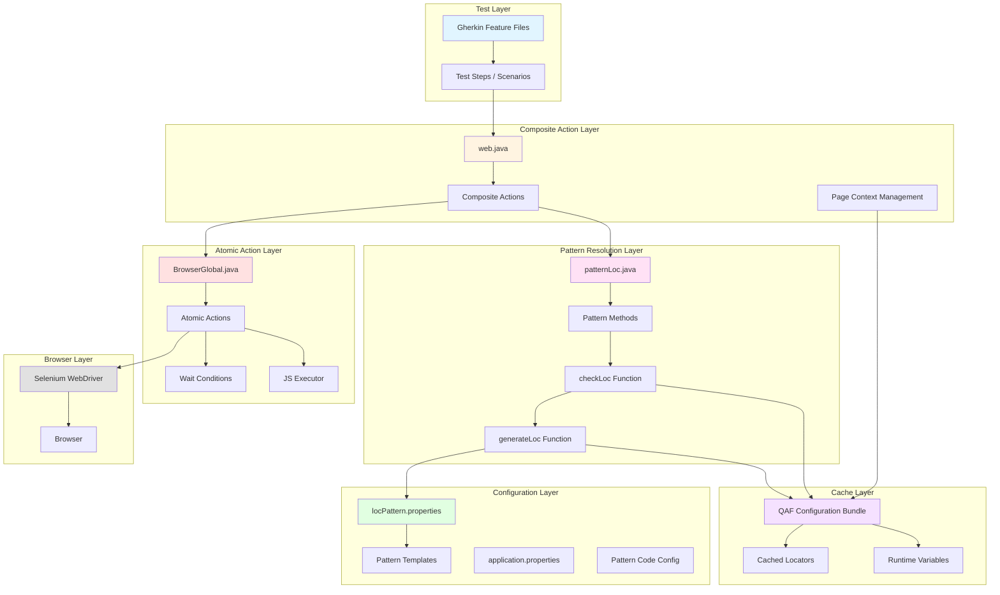

### Layer Responsibilities

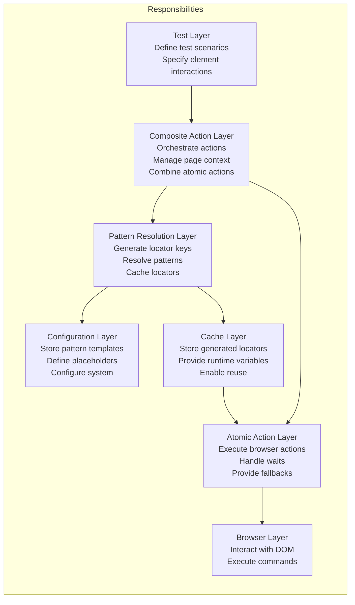

## Component Interaction Flow Diagram

### Complete Interaction Sequence

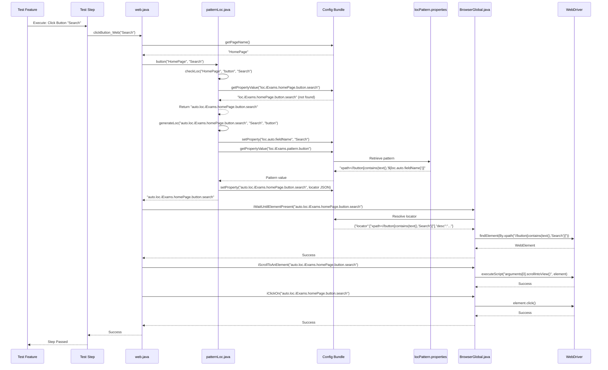

### Cached Locator Interaction (Subsequent Request)

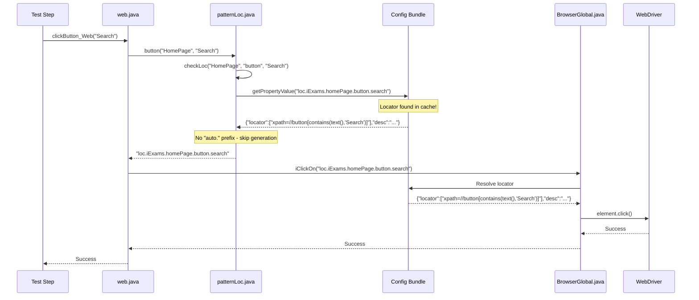


## Locator Resolution Sequence Diagram

### First-Time Locator Resolution

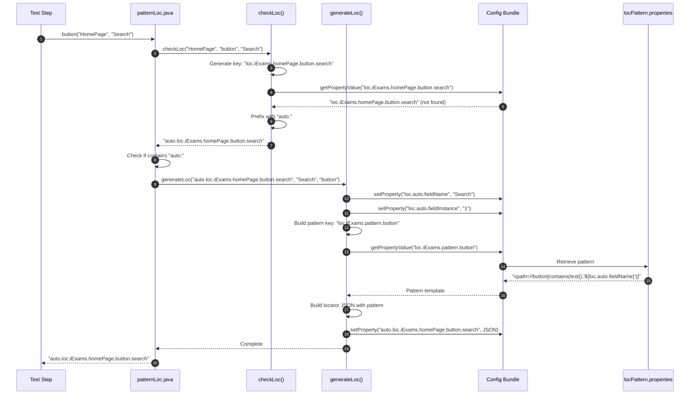

### Cached Locator Resolution

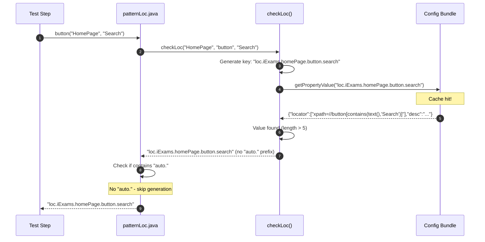

## Pattern Fallback Flow Diagram

### Multiple Pattern Attempt Sequence

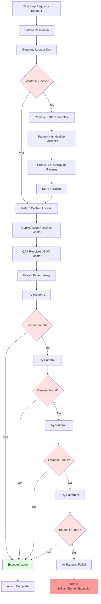

### Fallback Pattern Example Flow

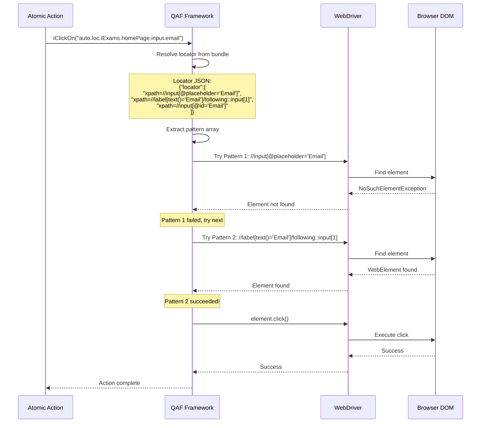

## Data Flow Architecture

### Pattern Configuration to Execution Flow

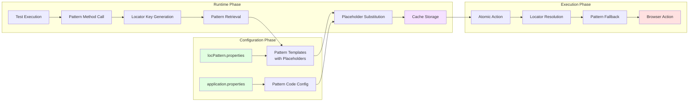

### Page Context Data Flow

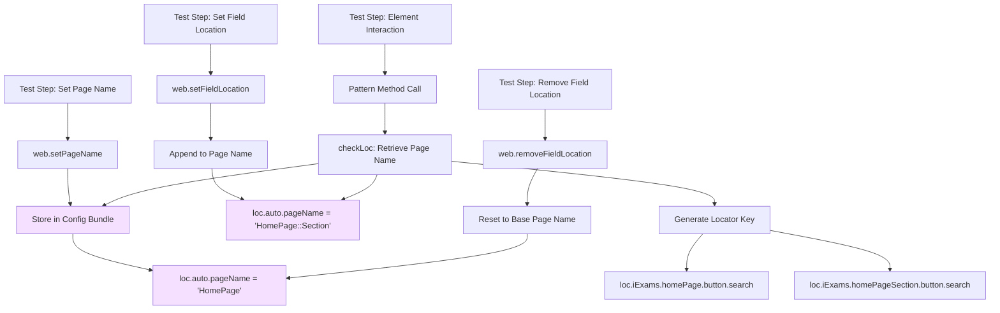

### Field Name Processing Flow

```mermaid
graph TD
    A[Test Step: 'Email Address[2]'] --> B[Pattern Method Receives Field Name]
    B --> C[fieldNameCheck Function]
    C --> D{Contains '[' and ends with ']'?}
    
    D -->|Yes| E[Split on '[']
    D -->|No| F[Return Original Field Name]
    
    E --> G[Extract Field Name: 'Email Address']
    E --> H[Extract Instance: '2']
    
    F --> I[Set loc.auto.fieldName]
    G --> I
    
    H --> J[Set loc.auto.fieldInstance = '2']
    D -->|No| K[Set loc.auto.fieldInstance = '1']
    
    I --> L[CaseUtils.toCamelCase]
    L --> M[Result: 'emailAddress']
    
    M --> N[Build Locator Key]
    J --> N
    K --> N
    
    N --> O[loc.iExams.homePage.input.emailAddress2]
    
    I --> P[Pattern Substitution]
    P --> Q[xpath=//input[@placeholder='Email Address']]
    
    style I fill:#f5e1ff
    style J fill:#f5e1ff
    style K fill:#f5e1ff
```

## Component Dependency Diagram

### Module Dependencies

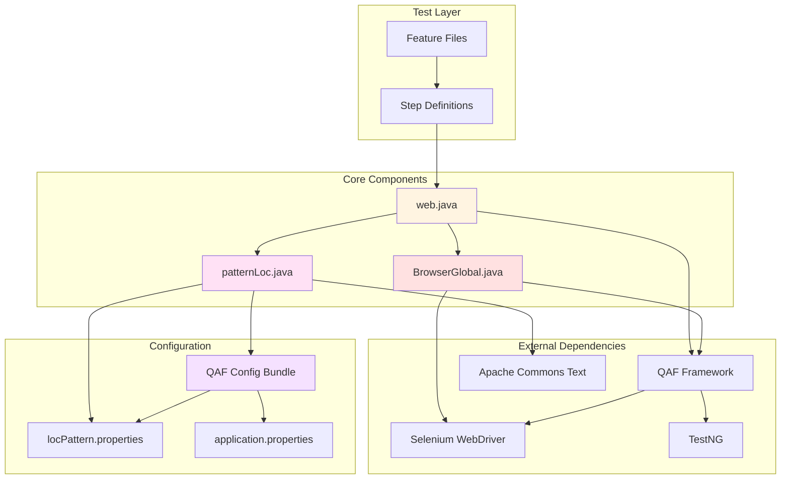

### Class Relationship Diagram

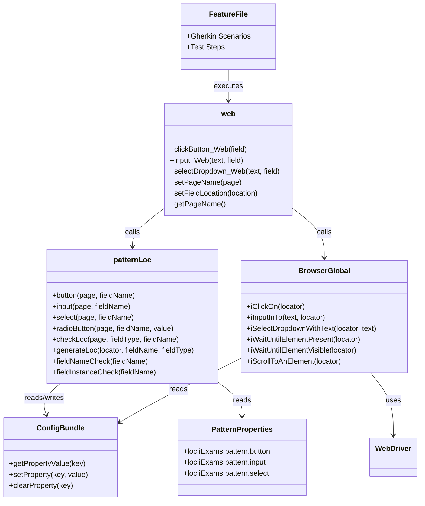

## Error Handling Flow Diagram

### Error Detection and Recovery

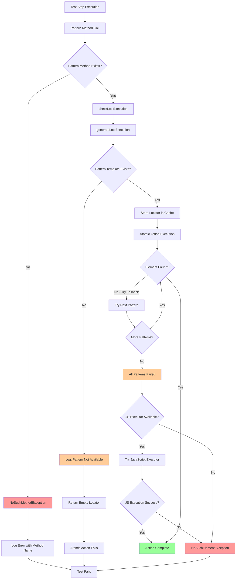

### JavaScript Executor Fallback Flow

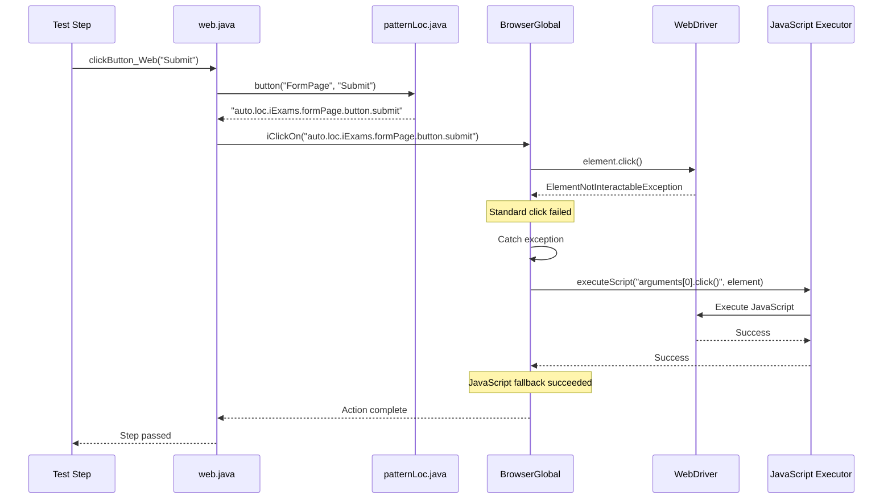

## Performance Optimization Flow

### Cache Performance Impact

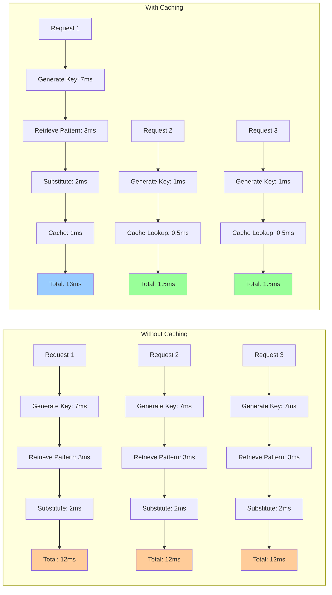

## Requirements Validation

This documentation addresses all requirements through comprehensive diagrams:

**All Requirements**: ✅ Visualized through architecture and flow diagrams
- High-level architecture shows all system layers and their relationships
- Component interaction diagrams illustrate communication patterns
- Sequence diagrams detail locator resolution and caching flows
- Fallback flow diagrams show pattern attempt sequences
- Data flow diagrams trace information from configuration to execution
- Error handling diagrams show detection and recovery mechanisms
- Performance diagrams illustrate caching benefits

## Summary

This documentation provides comprehensive visual representations of the pattern-based locator system architecture. Key diagrams include:

- **High-level architecture**: Shows all system layers and their responsibilities
- **Component interactions**: Illustrates how components communicate during execution
- **Locator resolution sequences**: Details first-time and cached locator resolution
- **Pattern fallback flows**: Shows how multiple patterns are attempted
- **Data flow diagrams**: Traces data from configuration through execution
- **Error handling flows**: Visualizes error detection and recovery mechanisms
- **Performance optimization**: Demonstrates caching benefits

These diagrams serve as visual references for understanding system architecture, implementing similar systems in other frameworks, and troubleshooting issues.
